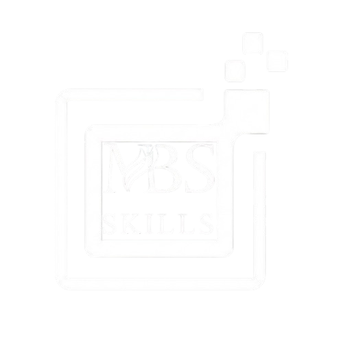

# MBSkills - Formation Technologique Professionnelle



A modern, professional training platform designed to help professionals develop their technological skills through practical, certified training programs adapted to the job market in Tunisia.

🌐 **Live Site**: [https://mbskills-website.vercel.app/](https://mbskills-website.vercel.app/)

## 🎯 Features

### Core Offerings
- **8 Training Domains**: Web Development, AI-Powered Development, Mobile Apps, Artificial Intelligence, Data Science, Cloud Computing, and Cybersecurity
- **24/7 Support System**: Dedicated instructors and AI-powered assistance available around the clock
- **Practical Approach**: 85% hands-on projects from day one
- **Lifetime Access**: Continuous content updates and access to alumni network
- **92% Employment Rate**: Strong job placement success after certification

### Interactive Components
- **ROI Calculator**: Dynamic salary projection tool showing potential career growth and return on investment
- **Support Demo**: Interactive chat interface showcasing the 24/7 student support system
- **Multi-Platform Integration**: Connects with LMS, LinkedIn, Calendar, and Email systems
- **Student Progress Tracking**: Real-time monitoring and personalized resource recommendations
- **Testimonials Carousel**: Animated showcase of student success stories

### Key Statistics
- 85% practical projects in courses
- 24/7 instructor and AI support
- 92% post-certification employment rate
- Unlimited access to content updates
- Average starting salary: 48,000 TND

## 🛠️ Technologies Used

- **Framework**: Next.js / React
- **Styling**: Tailwind CSS
- **Deployment**: Vercel
- **Language**: French (Tunisia market)
- **Design**: Modern, responsive UI with smooth animations

## 📋 Pages & Sections

- **Hero Section**: Main value proposition with call-to-action
- **Skills Showcase**: Interactive display of 8 core technology domains
- **Pedagogical Approach**: Comparison of traditional vs MBSkills methodology
- **Support System**: Visual demonstration of 24/7 assistance features
- **Demo Interface**: Interactive chat simulation
- **Testimonials**: Student success stories with carousel
- **ROI Calculator**: Interactive salary projection tool
- **Footer**: Complete navigation and social links

## 🚀 Getting Started

### Prerequisites
- Node.js 16.x or higher
- npm or yarn package manager

### Installation

```bash
# Clone the repository
git clone https://github.com/yourusername/mbskills-website.git

# Navigate to project directory
cd mbskills-website

# Install dependencies
npm install
# or
yarn install

# Run development server
npm run dev
# or
yarn dev
```

Open [http://localhost:3000](http://localhost:3000) in your browser to see the application.

### Build for Production

```bash
# Create production build
npm run build

# Start production server
npm start
```

## 🎨 Design Highlights

- Modern, clean interface with professional aesthetics
- Smooth animations and transitions
- Mobile-responsive design
- Interactive elements throughout
- Bilingual support (French primary)
- Accessible color scheme and typography

## 📊 ROI Calculator Features

The interactive calculator allows prospective students to:
- Input current salary (12K - 120K TND range)
- Specify training cost (1.5K - 12K TND range)
- Select career domain and experience level
- View projected salary increase
- Calculate payback period and 5-year ROI
- See market insights specific to Tunisia

## 🤝 Contributing

Contributions are welcome! Please feel free to submit a Pull Request.

## 📄 License

© 2025 MBSkills. All rights reserved.

## 🙏 Acknowledgments

- Built with modern web technologies
- Designed for the Tunisian tech education market
- Focused on practical, career-oriented training

---

**Developed by Amir dridi**
